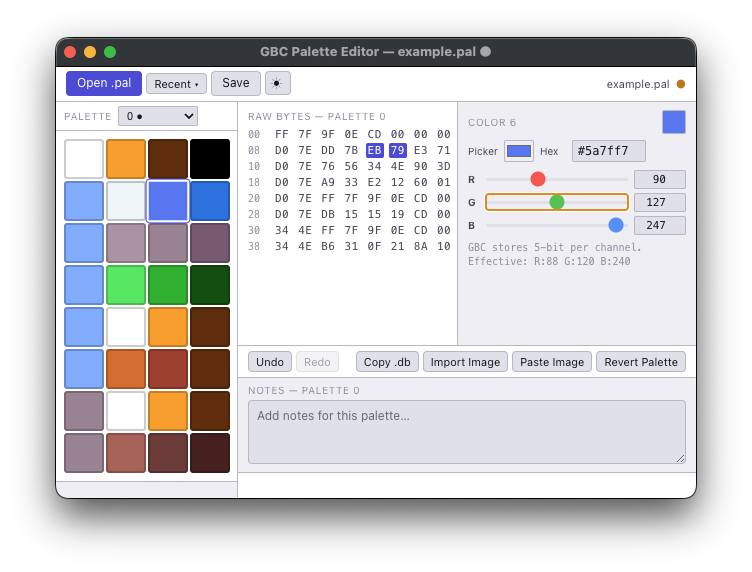
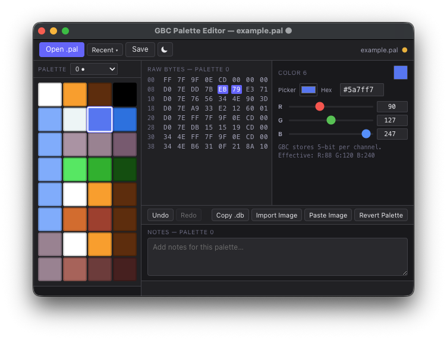

# GBC Palette Editor

A macOS desktop tool for editing `.pal` files used in Game Boy Color ROM hacks.

Built with Electron, React, and TypeScript.

---

## Why this exists

Most Game Boy colorization utilities are Windows-only. That is fine if you use Windows. I do not, primarily.

I wanted to experiment with colorizing original Game Boy games on macOS, and the tooling situation was either "run it under Wine and hope" or "just get a Windows machine." Neither appealed to me, so I started rebuilding the tools I needed.

This is the first one.

---

## Credit

This tool is a recreation and reinterpretation of **GBC Palette Editor** by **toruzz**.

Original utility: https://www.romhacking.net/utilities/1743/

Toruzz also maintains technical documentation on Game Boy colorization techniques at https://toruzz.com/blog — which was essential reference material during development.

This project is not a replacement for the original. toruzz built something useful. I needed something that ran on my machine. If you are on Windows, the original may serve you better.

---

## What it does

- Open, edit, and save `.pal` files
- Visualize all 32 colors per palette block in a swatch grid
- View raw hex bytes for the active palette block
- Edit individual colors by RGB channel with correct Game Boy Color 5-bit per-channel handling
- Sample palette colors from an image file or clipboard image
- Copy the current palette block as formatted hex (Copy .db)
- Undo and redo individual color edits within a session
- Store per-file notes attached to each palette index
- Light and dark theme, persisted across launches
- Recent files list
- Drag-and-drop support for `.pal` files and images

### Copy .db

The Copy .db button exports the currently selected palette block to the clipboard as plain uppercase hex — no spaces, eight rows of eight bytes each. This matches how palette data is typically presented in ROM hacking contexts and is directly usable in a hex editor or patcher.

### Notes

Notes are stored per palette index in a sidecar file next to the `.pal` file. The sidecar has the same base name as the `.pal` file with a `.notes.json` extension. If you move or rename the `.pal` file without moving the sidecar alongside it, the notes stay behind.

---

## Screenshots




---

## Download

**[GBC_Palette_Editor-1.0.0.zip](https://github.com/krizdingus/gbc-palette-editor/dist/GBC_Palette_Editor-1.0.0.zip)**

macOS, Apple Silicon. Signed and notarized. Includes the app, `example.pal`, and a short README.

---

## Example file

`example.pal` is included in the download alongside the app. It contains four palette blocks from a real colorization project and is a reasonable place to start before working on your own files. Open it from the same folder you unzipped the download into.

---

## Running locally

You will need Node.js (v18 or later) and npm.

```bash
git clone <repo>
cd gbc-palette-editor
npm install
npm run dev
```

This starts the Electron app in development mode with hot reload for the renderer.

---

## Building

```bash
npm run build
```

Compiles TypeScript and bundles the renderer via Vite. Output goes to `out/`.

For a packaged distributable, see [BUILD.md](./BUILD.md).

---

## Known rough edges

- One file at a time. Multiple windows are not supported.
- Palette count is inferred from file size. Files that are not a multiple of 64 bytes trigger a warning dialog before opening.
- Undo and redo are session-only. Closing the app clears history.
- The Electron choice is not glamorous, but I am a web developer and I was not going to learn Swift to build a small utility.

---

## Philosophy

This is one focused utility. It does one thing: edit `.pal` files.

The goal is a small set of tools that collectively cover the Game Boy colorization workflow on platforms that have historically been ignored. Not a full ROM hacking suite. Not trying to become one. Each tool should be small enough to understand, maintain, and use without a tutorial.

---

## License

Free to use, modify, and share for non-commercial purposes. You cannot sell it.

See [LICENSE](./LICENSE) for the full terms.

---

## Legal Addendum

A supplementary legal document prepared by H. Maury Spiderman, Esq. has been filed as [LEGAL_ADDENDUM.md](./LEGAL_ADDENDUM.md). It is not the actual license and carries no legal authority. It is included for reasons that will become clear upon reading.

---

## Author

Krizdingus — [krizdingus.com](https://krizdingus.com)
